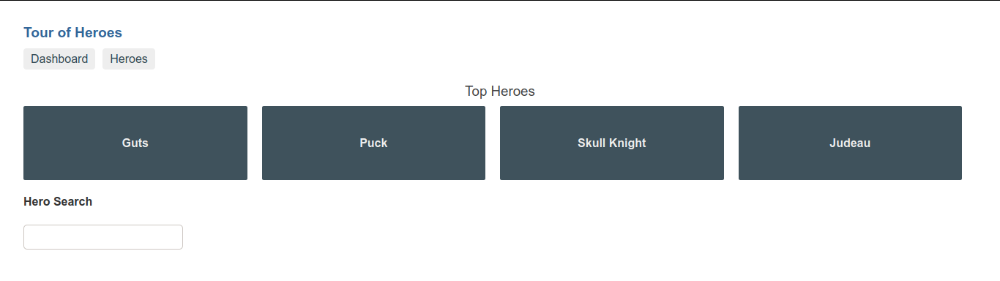
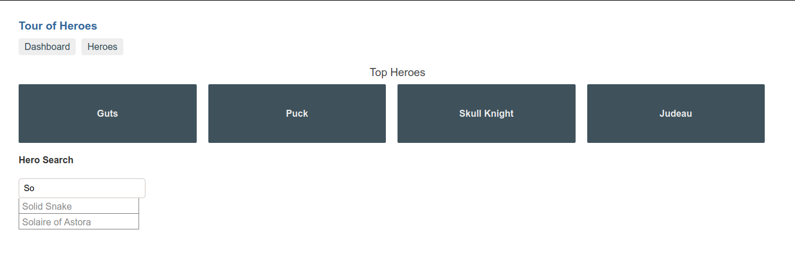
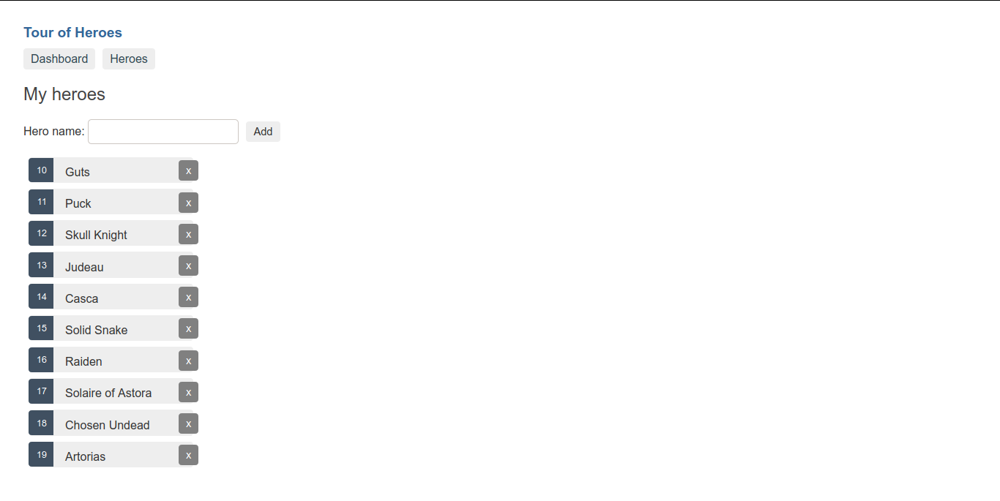
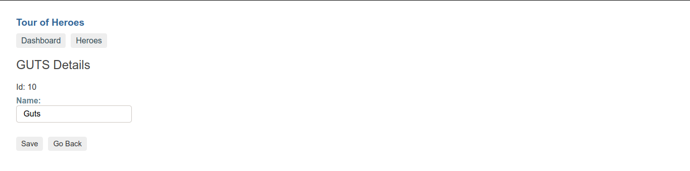

<h1 align="center">Tour Of Heroes</h1>

  

  
  
  

  

  <a href="#tour-of-heroes">Tour Of Heroes</a>&nbsp;&nbsp;&nbsp;|&nbsp;&nbsp;&nbsp;
  <a href="#development-server">Development Server</a>&nbsp;&nbsp;&nbsp;|&nbsp;&nbsp;&nbsp;
  <a href="#build">Build</a>&nbsp;&nbsp;&nbsp;|&nbsp;&nbsp;&nbsp;
  <a href="#how-to-contribute">How to Contribute</a>&nbsp;&nbsp;&nbsp;|&nbsp;&nbsp;&nbsp;
  <a href="#license">License</a>

 

  <kbd>
    
  </kbd>
  <kbd>
    
  </kbd>
  <kbd>
    
  </kbd>
  <kbd>
    
  </kbd>

## Tour Of Heroes

Project created following the [official tutorial](https://angular.io/tutorial) for beginners at Angular Docs.

## Development Server

Run `ng serve` for a dev server. Navigate to `http://localhost:4200/`. The app will automatically reload if you change any of the source files.

## Build

Run `ng build` to build the project. The build artifacts will be stored in the `dist/` directory. Use the `--prod` flag for a production build.

## How to Contribute

To contribute with this project:

- Do a fork of this repository;
- Create a branch with your feature: `git checkout -b my-feature`;
- Commit your changes: `git commit -m 'feat: 'My feature details'`.
- Push the commits to your branch `git push origin my-feature`.

After the merge of your pull request has been made, you can delete your branch.

## License

This project is licensed under the MIT License. See the [license](https://opensource.org/licenses/MIT) page for details.
